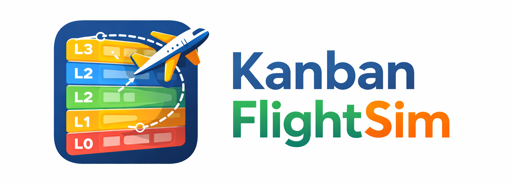

# Kanban Flight Simulator

A visual Kanban flow simulator for understanding multi-level hierarchical workflows. Built as an educational tool to explore concepts like upstream/downstream, commitment points, delivery points, and WIP limits across four levels of work.

## What it does

The simulator models work flowing through four hierarchical levels simultaneously:

```
L3 (e.g. Project)  ─── contains ──▶  L2 (e.g. Epic)
L2 (e.g. Epic)     ─── contains ──▶  L1 (e.g. Story)
L1 (e.g. Story)    ─── contains ──▶  L0 (e.g. Subtask)
```

Each level has its own Kanban board with configurable statuses. Work items advance through their workflow tick by tick, following hierarchical rules: a parent item is unblocked only when its children complete their work; children are created automatically when a parent reaches its commitment point.

## Getting started

```bash
npm install
npm run dev
```

## Controls

| Button | Action |
|--------|--------|
| **Step** | Advance the simulation one tick |
| **Autoplay** | Run continuously (one tick/second). Press again to pause |
| **Reset** | Return to the initial state |
| **Upstream / Downstream** | Highlight columns by stream zone |
| **Status Category** | Highlight columns by category (TODO / IN-PROGRESS / DONE) |
| **Commitment Status** | Highlight the commitment point column on each board |
| **Delivery Status** | Highlight the delivery point column on each board |

Use the dropdown in the header to switch between available simulations.

## Configuration

All simulations are defined in [`src/config/defaultConfig.json`](src/config/defaultConfig.json). Each simulation specifies:

- Four workflows (L3, L2, L1, L0), each with an ordered list of statuses
- `advanceProbability` — probability each eligible work item advances per tick (default: `0.5`)
- `childrenPerParent` — how many child work items are created at the commitment point (default: `3`)
- `initialReleaseCount` — number of L3 work items to start with (default: `1`)

Each status supports:
- `streamType`: `UPSTREAM` or `DOWNSTREAM`
- `isBeforeCommitmentPoint`: marks the status where children are spawned
- `isPosDeliveryPoint`: marks the final status (work item stops here)
- `wipLimit`: optional cap on how many work items can occupy this column at once

Adding a new simulation is as simple as appending a new entry to the `simulations` array in the JSON — no code changes needed.

## Bundled simulations

| Name | Levels |
|------|--------|
| **Simplified** | Project → Epic → Story → Subtask, 4 statuses each |
| **SDF workflows** | Project (7 statuses) → Release (10) → Feat (8) → Spec (7) |

## Architecture

```
src/
├── config/
│   ├── defaultConfig.json   # Source of truth: simulations, workflows, parameters
│   └── defaultConfig.ts     # Loads JSON and derives the `category` field
├── domain/
│   └── types.ts             # TypeScript types: Workitem, Workflow, Status, SimState, Config
├── simulation/
│   └── engine.ts            # Pure functions: buildInitialState() and tick()
├── components/
│   ├── Board.tsx            # One board per level
│   ├── Column.tsx           # One column per status
│   └── Card.tsx             # One card per work item
└── App.tsx                  # Root: state, controls, board composition
```

The simulation engine is a **pure function** — `tick(state, config) → state` — with no side effects. This makes it easy to test, replay, and drive with `setInterval` for autoplay.

## Documentation

Full requirements specification: [`doc/mvp-software-spec.md`](doc/mvp-software-spec.md)

## Stack

- React + Vite
- TypeScript
