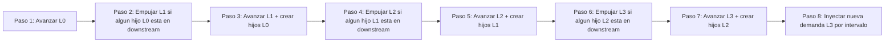
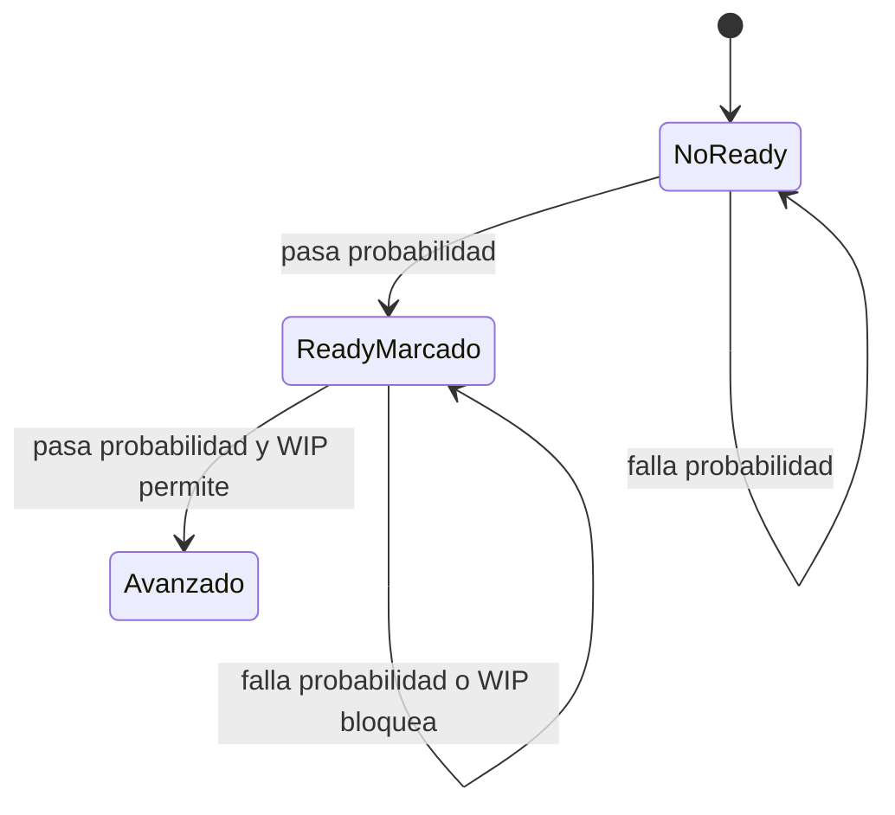

# Modelo de Simulacion v2 (Onboarding)

## 1. Proposito

Este documento explica el modelo de simulacion en modo onboarding: menos formal, mas practico y enfocado en ayudar a una persona nueva en el proyecto a entender como funciona realmente el sistema.

Alcance cubierto:
- Arquitectura y responsabilidades por modulo
- Paradigma de programacion usado en el proyecto
- Mecanica del tick y orden de ejecucion
- Reglas jerarquicas (padre-hijo) y logica de desbloqueo
- Aplicacion de WIP, senal de ready y demanda continua
- Como interactua la UI con el motor

## 2. Modelo mental en 60 segundos

Piensa la aplicacion como una envoltura determinista alrededor de un motor probabilistico.

- Envoltura determinista:
  - React guarda el estado.
  - Las acciones de usuario (Step, Autoplay, Reset) llaman la misma funcion del motor.
  - El render es una proyeccion pura del estado en tableros/columnas/tarjetas.
- Motor probabilistico:
  - En cada tick decide que items elegibles avanzan.
  - La probabilidad es configurable (`advanceProbability`).
  - El comportamiento se basa en propiedades estructurales del workflow (no en nombres hardcodeados de estados).

## 3. Arquitectura de alto nivel

```mermaid
flowchart TD
  A[defaultConfig.json] --> B[defaultConfig.ts]
  B --> C[Objeto Config tipado]
  C --> D[buildInitialState]
  D --> E[SimState en React]

  E --> F[Accion de usuario: Step]
  E --> G[Intervalo de Autoplay]
  F --> H[tick(state, config)]
  G --> H
  H --> I[Siguiente SimState]
  I --> J[Render de Board / Column / Card]
```

Modulos principales:
- Cargador de configuracion: src/config/defaultConfig.ts
- Tipos de dominio: src/domain/types.ts
- Motor de simulacion: src/simulation/engine.ts
- Orquestacion de la app: src/App.tsx
- Componentes visuales: src/components/Board.tsx, src/components/Column.tsx, src/components/Card.tsx

## 4. Paradigma de programacion

Estilo principal:
- Nucleo funcional:
  - El punto de entrada del motor es puro: `tick(state, config) -> state`
  - No hay red, almacenamiento ni efectos secundarios ocultos dentro de la logica del motor
- UI declarativa:
  - React mapea estado a estructura visual
- Tipado estatico:
  - Los contratos del dominio son explicitos y compartidos

OO es minimo y localizado:
- ErrorBoundary es un componente de clase, pero esto no afecta la semantica de simulacion.

## 5. Modelo de dominio (sobre lo que razona el motor)

Entidades centrales:
- Status:
  - orden en el workflow
  - zona de flujo (UPSTREAM o DOWNSTREAM)
  - marcador de compromiso (`isBeforeCommitmentPoint`)
  - marcador de entrega (`isPosDeliveryPoint`)
  - limite WIP opcional (`wipLimit`)
  - compuerta opcional en dos fases (`hasReadySignal`)
  - marcador de buffer opcional (`isBuffer`)
- Workflow:
  - uno por nivel (L3/L2/L1/L0)
  - lista ordenada de estados
- Workitem:
  - id, level, statusId
  - parentId opcional
  - isReady opcional (usado por transiciones en dos fases)
- SimState:
  - arreglo de workitems
  - numero de tick
  - contadores de id por nivel

Importante: la categoria del status (TODO / IN_PROGRESS / DONE) se deriva al cargar la configuracion.

## 6. Pipeline del tick (implementacion real)

El motor ejecuta un pipeline ordenado de 8 pasos en cada tick.



Por que importa el orden:
- El movimiento de niveles bajos puede desbloquear movimiento de padres en el mismo tick.
- La creacion de hijos ocurre antes de que terminen ciertas validaciones de completitud en downstream de niveles superiores.
- Los contadores WIP son mutables dentro de cada fase para evitar sobre-admision por carrera.

## 7. Comportamiento padre-hijo

Las reglas por par de niveles son simetricas (L0->L1, L1->L2, L2->L3):

1. Activacion forzada del padre:
- Si algun hijo entra a downstream, el padre es empujado a su primer estado downstream (si WIP lo permite).

2. Bloqueo del padre en primer downstream:
- El padre no puede avanzar desde primer downstream hasta que todos sus hijos directos esten en entrega.

3. Creacion de hijos en compromiso:
- Cuando el padre avanza desde estado de compromiso, crea N hijos una sola vez (`childrenPerParent`) en el primer estado del workflow hijo.

Esto da al modelo un efecto claro de arrastre desde ejecucion, preservando dependencia jerarquica.

## 8. Senal de ready en dos fases

Para estados con `hasReadySignal`, la transicion usa dos fases:



Interpretacion:
- Fase A marca el item como listo (`isReady = true`) sin cambiar de columna.
- Fase B realiza el movimiento de columna y limpia la bandera de ready.

Para estados sin ready-signal, el item intenta movimiento directo en una sola fase.

## 9. Mecanismo WIP

WIP se aplica con un tracker mutable por fase:
- Inicializa conteos desde el snapshot actual.
- En movimiento aprobado de A a B:
  - decrementa A
  - incrementa B
- Rechaza movimiento si el destino alcanzo su `wipLimit`.

Esto evita colisiones dentro de la misma fase, donde multiples items podrian superar un limite a la vez.

## 10. Mecanica de IDs y jerarquia

Generacion de IDs:
- Prefijo = primeros 4 caracteres de `workitemName` del workflow, en mayusculas.
- Los contadores por nivel son independientes (L0, L1, L2, L3).
- Si el item tiene padre, se agrega sufijo con base del padre: p<parentBaseId>.

Forma de la jerarquia:
- L3 no tiene padre.
- Los hijos L2 apuntan a padre L3.
- Los hijos L1 apuntan a padre L2.
- Los hijos L0 apuntan a padre L1.

## 11. Inicializacion y demanda

Estado inicial:
- Crea `initialReleaseCount` items L3 en el primer estado de L3.
- Inicializa contadores de forma consistente con los items creados.

Demanda continua:
- Si `demandInterval > 0`, cada N ticks se inyecta un nuevo item L3 en el primer estado de L3.
- Esto extiende el comportamiento base del MVP con un modelo de llegada orientado a flujo.

## 12. Detalles de integracion con UI

Orquestacion en App:
- Boton Step: un tick
- Autoplay: tick repetido cada 1000 ms
- Reset: reconstruye estado inicial de la simulacion seleccionada
- Selector de simulacion: carga otra configuracion y resetea estado

Visualizacion:
- Board renderiza un nivel de workflow
- Column renderiza un estado y sus workitems
- Card renderiza un workitem y sus senales visuales

Senales visuales utiles:
- Conteo WIP en encabezado de columna
- Subrayado de estado de compromiso
- Resaltado de estado de entrega
- Indicador de buffer
- Indicador de ready en tarjetas cuando aplica

## 13. Diferencia conocida y nota tecnica

Observado en la configuracion actual:
- En el workflow SDF de L1 hay dos estados con el mismo id (`feat-refining`).
- Motor y UI dependen de busquedas por id de estado, por lo que ids duplicados pueden generar comportamiento ambiguo.

Accion recomendada:
- Hacer unicos todos los ids de estado dentro de cada workflow antes de basarse en analitica o replay deterministico.

## 14. Mapa de archivos para personas nuevas

Orden sugerido de lectura:
1. src/domain/types.ts
2. src/config/defaultConfig.ts
3. src/simulation/engine.ts
4. src/App.tsx
5. src/components/Column.tsx

Esta secuencia da: modelo -> hidratacion de config -> comportamiento -> wiring de app -> detalles de render.

## 15. Conclusion practica

El modelo de simulacion es un motor configurable con nucleo funcional, reglas jerarquicas de flujo y movimiento restringido (WIP + readiness), envuelto por un loop liviano de UI en React. La mayoria de cambios de comportamiento deberian intentarse primero via configuracion y despues en el motor solo cuando se introduzcan clases nuevas de reglas.
